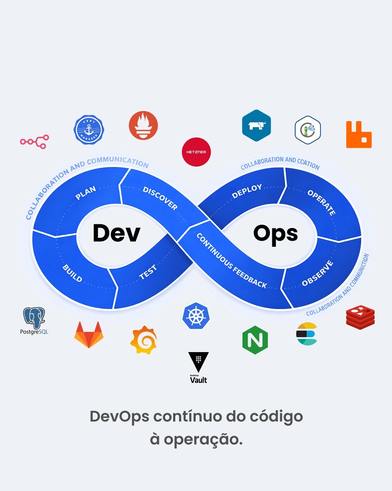

# K3s na Hetzner Cloud 🚀

> Cluster Kubernetes de produção com alta disponibilidade e custo reduzido usando K3s e Hetzner Cloud

[](https://opensource.org/licenses/MIT)
[](https://k3s.io/)
[](https://www.hetzner.com/cloud)

---

💰 **Cluster Kubernetes de Produção a partir de €32/mês (R$199)**  
🚀 **Base**: K3s HA (3 Masters + 3 Workers) + NGINX Ingress + Cert-Manager  
📊 **Até 17x mais barato** que AWS | **15x mais barato** que GCP  
✅ **Caso real**: Stack completa em produção por €43,55/mês

---

## 📋 Índice

- [Sobre o Projeto](#-sobre-o-projeto)
- [Por Que Hetzner?](#-por-que-hetzner)
- [Comparação de Custos](#-comparação-de-custos)
- [Arquitetura](#-arquitetura)
- [Stack Completo em Produção](#-stack-completo-em-produção)
- [Pré-requisitos](#-pré-requisitos)
- [Instalação](#-instalação)
- [Configuração](#-configuração)
- [Pós-instalação](#-pós-instalação)
- [Troubleshooting](#-troubleshooting)
- [Contribuindo](#-contribuindo)

## 🎯 Sobre o Projeto

Este repositório fornece uma solução completa e pronta para produção para criar clusters Kubernetes de **baixo custo** usando **K3s** na **Hetzner Cloud**. 

### O que vem configurado no cluster base:

- ✅ **3 Masters CX23** em alta disponibilidade (HA) com ETCD
- ✅ **3 Workers CX33** para workloads de aplicação
- ✅ **Load Balancer** Hetzner (LB11) para ingress
- ✅ **NGINX Ingress Controller** instalado via post-install
- ✅ **Cert-Manager** com Let's Encrypt (SSL/TLS automático)
- ✅ **Backup automático** de ETCD para S3
- ✅ **CSI Driver** Hetzner (suporta volumes persistentes)
- ✅ **Rede privada** 10.0.0.0/24 para comunicação segura
- ✅ **System Upgrade Controller** para atualizações automatizadas
- ✅ **Cloud Controller Manager** integração com Hetzner API

### O que você pode adicionar depois (opcional):

O cluster base suporta adicionar qualquer stack que desejar. Veja a seção [Stack Completo em Produção](#-stack-completo-em-produção) para um exemplo real.

## 💰 Por Que Hetzner?

A Hetzner Cloud oferece uma das **melhores relações custo-benefício** do mercado para infraestrutura de computação em nuvem:

### Vantagens da Hetzner

1. **Preço Extremamente Competitivo** - Até **17x mais barato** que AWS (€32 vs $550/mês)
2. **Performance Sólida** - CPUs AMD EPYC/Intel com boa performance mesmo em planos compartilhados
3. **Datacenter na Europa** - Baixa latência e conformidade com GDPR
4. **Tráfego Incluído** - 20TB/mês incluídos sem cobranças surpresa
5. **Storage SSD Rápido** - Volumes NVMe a €0.044/GB (10x mais barato que AWS EBS)
6. **Interface Simples** - API e UI intuitivas
7. **Sem Lock-in** - Fácil migração usando Kubernetes padrão
8. **Billing Transparente** - Sem custos ocultos ou surpresas na fatura

> 💡 **Nota**: Os planos CX usam vCPUs compartilhadas. Para CPUs dedicadas, considere os planos CCX (custo maior).

### Quando Considerar Alternativas

- **AWS/GCP/Azure**: Quando você precisa de serviços gerenciados específicos (RDS, DynamoDB, etc.)
- **Oracle Cloud**: Free tier generoso para projetos pessoais/pequenos
- **DigitalOcean**: Kubernetes gerenciado sem configuração (maior custo)

## 📊 Comparação de Custos

### Custo Base do Cluster (Configuração Mínima)

Comparação do **cluster base** K3s HA pronto para produção:

| Provider | Config | CPUs | RAM | Custo/Mês | Custo Anual |
|----------|--------|------|-----|-----------|-------------|
| **Hetzner** | 3x CX23 + 3x CX33 + LB | 24 vCPU | 36 GB | **€32.33** (**R$201**) | **€387.96** (**R$2.410**) |
| AWS EKS | Control Plane + 6 nodes | 24 vCPU | 36 GB | **~$550** | **~$6.600** |
| GCP GKE | 6 nodes (sem managed) | 24 vCPU | 36 GB | **~$480** | **~$5.760** |
| Azure AKS | 6 nodes (managed free) | 24 vCPU | 36 GB | **~$420** | **~$5.040** |
| Oracle Cloud | 6 VMs | 24 vCPU | 36 GB | **~$280** | **~$3.360** |

> 💡 **Economia de até 94%** comparado à AWS e até 88% comparado ao Oracle Cloud!

### 💰 Detalhamento: Cluster Base

**O que está incluído na configuração padrão:**

| Item | Descrição | Qtd | Preço Unit. | Subtotal |
|------|-----------|-----|-------------|----------|
| CX23 | Masters (2 vCPU, 4 GB RAM) | 3 | €3.49 | **€10.47** |
| CX33 | Workers (4 vCPU, 8 GB RAM) | 3 | €5.49 | **€16.47** |
| LB11 | Load Balancer | 1 | €5.39 | **€5.39** |
| | | | | |
| **CUSTO BASE MENSAL** | | | | **€32.33** |
| **CUSTO BASE (BRL)** | | | (câmbio €1 = R$6.21) | **R$200.77** |

**Recursos do Cluster Base:**
- 🖥️ **24 vCPUs** distribuídos em 6 servidores
- 💾 **36 GB RAM** total (3x 4GB + 3x 8GB)
- 💿 **160 GB SSD local** nos servidores (para SO e cache)
- 🌐 **1 Load Balancer** Hetzner com IP público
- 🔒 **Rede privada** 10.0.0.0/24 entre nós
- 🔐 **SSL/TLS grátis** via Let's Encrypt + Cert-Manager

### 📦 Exemplo: Stack Completa em Produção (Opcional)

**Caso de uso real:** Adicionando volumes persistentes para rodar stack completa de SaaS:

| Storage (CSI Volumes) | Uso | Qtd | Preço Unit. | Subtotal |
|----------------------|-----|-----|-------------|----------|
| 50 GB | Prometheus (métricas) | 1 | €2.20 | **€2.20** |
| 25 GB | Loki (logs) | 1 | €1.10 | **€1.10** |
| 10 GB | Redis (cache) | 2 | €0.44 | **€0.88** |
| 10 GB | RabbitMQ (mensageria) | 3 | €0.44 | **€1.32** |
| 10 GB | PostgreSQL (databases) | 2 | €0.44 | **€0.88** |
| 10 GB | Elasticsearch (logs/busca) | 3 | €0.44 | **€1.32** |
| 10 GB | Harbor (container registry) | 8 | €0.44 | **€3.52** |
| 10 GB | Vault (secret management) | 2 | €0.44 | **€0.88** |
| | | | **Subtotal Volumes** | **€11.22** |
| | | | | |
| **TOTAL COM STACK COMPLETA** | | | | **€43.55** |
| **TOTAL (BRL)** | | | | **R$270.45** |

**Recursos Totais com Stack Completa:**
- Tudo do cluster base +
- 💿 **145 GB Storage extra** (21 volumes persistentes CSI)
- 📊 Observabilidade completa (Prometheus, Grafana, Loki)
- 🐳 Container Registry privado (Harbor)
- 🗄️ Múltiplos databases (PostgreSQL, Redis, Elasticsearch)
- 🔐 Gerenciamento de secrets (Vault)
- 📨 Message broker (RabbitMQ)

> ⚠️ Preços reais praticados em fevereiro de 2026. Câmbio: €1 = R$6.21  
> 💡 Os volumes são **opcionais** - você só paga pelo que usar!

### 💸 Comparação: Cluster Base vs Outros Provedores

**Custo do cluster base** (sem volumes adicionais):

| Provider | Custo Mensal | Custo Anual | Diferença vs Hetzner |
|----------|-------------|-------------|----------------------|
| **Hetzner (Base)** | €32.33 (R$201) | €387.96 (R$2.410) | **Baseline** ✅ |
| AWS EKS | ~$550 (R$3.400) | ~$6.600 (R$40.800) | **+1.601%** 🔴 |
| GCP GKE | ~$480 (R$2.970) | ~$5.760 (R$35.600) | **+1.385%** 🔴 |
| Azure AKS | ~$420 (R$2.600) | ~$5.040 (R$31.200) | **+1.199%** 🔴 |
| Oracle Cloud | ~$280 (R$1.730) | ~$3.360 (R$20.800) | **+766%** 🟡 |

**Economia anual (cluster base):**
- 💰 **R$38.390 vs AWS** (17x mais caro!)
- 💰 **R$33.190 vs GCP** (15x mais caro!)
- 💰 **R$28.790 vs Azure** (13x mais caro!)
- 💰 **R$18.390 vs Oracle Cloud** (8.6x mais caro!)

> 🎉 Com a economia de **1 ano** vs AWS, você roda o cluster na Hetzner por **mais de 17 anos**!

## 🏗 Arquitetura

```
┌─────────────────────────────────────────────────────────────┐
│                    Internet / Users                          │
└────────────────────┬────────────────────────────────────────┘
                     │
                     │ HTTPS/TLS (Let's Encrypt)
                     ▼
          ┌──────────────────────┐
          │  Hetzner Load Balancer│
          │     (LB11 - €5.83)    │
          └──────────┬───────────┘
                     │
         ┌───────────┴───────────┐
         │                       │
         ▼                       ▼
┌────────────────┐      ┌────────────────┐
│ NGINX Ingress  │      │ NGINX Ingress  │
│  Controller    │      │  Controller    │
└────────┬───────┘      └────────┬───────┘
         │                       │
         │   Private Network (10.0.0.0/24)
         │                       │
┌────────┴───────────────────────┴────────┐
│                                          │
│  ┌──────────────────────────────────┐   │
│  │   Control Plane (HA)             │   │
│  │  ┌─────────┐  ┌─────────┐       │   │
│  │  │Master 1 │  │Master 2 │       │   │
│  │  │ CX23    │  │ CX23    │       │   │
│  │  │ ETCD    │  │ ETCD    │       │   │
│  │  └────┬────┘  └────┬────┘       │   │
│  │       │            │             │   │
│  │       │  ┌─────────┴───────┐    │   │
│  │       │  │   Master 3       │    │   │
│  │       │  │   CX23           │    │   │
│  │       │  │   ETCD           │    │   │
│  │       │  └──────────────────┘    │   │
│  └──────────────────────────────────┘   │
│                                          │
│  ┌──────────────────────────────────┐   │
│  │   Worker Nodes                   │   │
│  │  ┌──────────────────────────┐    │   │
│  │  │  Pool: tools (2x CX33)   │    │   │
│  │  │  - NGINX Ingress         │    │   │
│  │  │  - Cert-Manager          │    │   │
│  │  │  - Monitoring            │    │   │
│  │  └──────────────────────────┘    │   │
│  │                                   │   │
│  │  ┌──────────────────────────┐    │   │
│  │  │  Pool: resources (1x CX33)│   │   │
│  │  │  - Aplicações            │    │   │
│  │  │  - Databases             │    │   │
│  │  └──────────────────────────┘    │   │
│  └──────────────────────────────────┘   │
│                                          │
└──────────────────────────────────────────┘
         │
         │ Backup ETCD (A cada 2h)
         ▼
┌────────────────────┐
│   S3 Storage       │
│   (AWS/Hetzner)    │
└────────────────────┘
```

### Componentes Principais

- **K3s**: Distribuição leve do Kubernetes otimizada para produção
- **ETCD**: Datastore distribuído em 3 nós (alta disponibilidade)
- **Hetzner Cloud Controller Manager**: Integração nativa com a infraestrutura Hetzner
- **Hetzner CSI Driver**: Provisionamento dinâmico de volumes persistentes
- **NGINX Ingress**: Roteamento HTTP/HTTPS para serviços
- **Cert-Manager**: Automação de certificados SSL/TLS com Let's Encrypt
- **System Upgrade Controller**: Atualizações automatizadas do cluster

## 🎨 Stack Completo em Produção

Este é um exemplo real de setup completo para SaaS rodando em K3s na Hetzner Cloud, incluindo todos os componentes de infraestrutura, monitoramento, CI/CD e gestão:



A imagem acima mostra um **exemplo real** de stack completa que PODE ser implementada sobre o cluster base, incluindo:

- **Automação**: n8n (web + workers) para workflows
- **Observabilidade**: Prometheus, Grafana para métricas e dashboards
- **CI/CD**: GitLab Runner, Harbor (container registry)
- **Gestão**: Rancher para gerenciamento do cluster
- **Segurança**: Cert-Manager (SSL/TLS), Vault (credenciais de clientes)
- **Ingress**: NGINX Ingress Controller
- **Databases**: 
  - 2x PostgreSQL (diferentes aplicações)
  - Redis Cluster (cache/sessions)
  - Elasticsearch Cluster (logs/busca)
- **Mensageria**: RabbitMQ Cluster
- **Infraestrutura**: Hetzner Cloud Controller Manager & CSI Driver

> 💡 **Este exemplo específico** roda no cluster base (€32,33) + volumes adicionais (€11,22) = **€43,55/mês total**  
> 📦 Você pode começar só com o cluster base e adicionar componentes conforme necessidade!

## 🔧 Pré-requisitos

### 1. Conta Hetzner Cloud

Crie uma conta em [Hetzner Cloud](https://console.hetzner.cloud/) e gere um **API Token**:

1. Acesse [Hetzner Cloud Console](https://console.hetzner.cloud/)
2. Vá em **Security** → **API Tokens**
3. Clique em **Generate API Token**
4. Dê um nome (ex: `k3s-cluster`) e permissões de **Read & Write**
5. **Copie e guarde o token** (não será exibido novamente)

### 2. Ferramentas Necessárias

```bash
# macOS (Homebrew)
brew install hcloud
brew tap vitobotta/tap
brew install vitobotta/tap/hetzner-k3s
brew install kubectl
brew install helm

# Linux (binários)
# hcloud CLI
wget https://github.com/hetznercloud/cli/releases/download/v1.40.0/hcloud-linux-amd64.tar.gz
tar xvf hcloud-linux-amd64.tar.gz
sudo mv hcloud /usr/local/bin/

# hetzner-k3s CLI
wget https://github.com/vitobotta/hetzner-k3s/releases/latest/download/hetzner-k3s-linux
chmod +x hetzner-k3s-linux
sudo mv hetzner-k3s-linux /usr/local/bin/hetzner-k3s

# kubectl
curl -LO "https://dl.k8s.io/release/$(curl -L -s https://dl.k8s.io/release/stable.txt)/bin/linux/amd64/kubectl"
chmod +x kubectl
sudo mv kubectl /usr/local/bin/

# helm
curl https://raw.githubusercontent.com/helm/helm/main/scripts/get-helm-3 | bash
```

### 3. Par de Chaves SSH

```bash
# Gerar chave SSH específica para o cluster
ssh-keygen -t ed25519 -C "k3s-hetzner" -f ~/.ssh/k3s-hetzner

# Adicionar ao ssh-agent (opcional)
eval "$(ssh-agent -s)"
ssh-add ~/.ssh/k3s-hetzner
```

### 4. Configurar Credenciais

```bash
# API Token da Hetzner
export HCLOUD_TOKEN="seu_token_aqui"

# Credenciais S3 para backup ETCD (AWS ou Hetzner Object Storage)
export ETCD_S3_ENDPOINT="https://s3.amazonaws.com"  # ou Hetzner Storage
export ETCD_S3_ACCESS_KEY="sua_access_key"
export ETCD_S3_SECRET_KEY="sua_secret_key"
```

## 🚀 Instalação

### Passo 1: Clone o Repositório

```bash
git clone https://github.com/seu-usuario/hetzner-k3s.git
cd hetzner-k3s
```

### Passo 2: Configurar Rede Privada na Hetzner

Antes de criar o cluster, crie uma rede privada:

```bash
hcloud context create k3s-production
hcloud network create --name k3s-production --ip-range 10.0.0.0/24
hcloud network add-subnet k3s-production --network-zone eu-central --type cloud --ip-range 10.0.0.0/24
```

### Passo 3: Revisar Configuração

Edite [k3s/cluster-config.yaml](k3s/cluster-config.yaml) conforme necessário:

```yaml
cluster_name: k3s-production
k3s_version: v1.35.0+k3s1

# Ajuste as localizações (datacenters)
masters_pool:
  instance_type: cx23  # 2 vCPU, 8 GB RAM
  instance_count: 3
  locations:
    - nbg1  # Nuremberg, Germany
    - fsn1  # Falkenstein, Germany (opcional: alta disponibilidade)
    - hel1  # Helsinki, Finland (opcional: alta disponibilidade)

# Workers - configure conforme sua necessidade
worker_node_pools:
  - name: workers  # Pode ter múltiplos pools ou apenas um
    instance_type: cx33  # 4 vCPU, 16 GB RAM
    instance_count: 3
    location: nbg1
```

**Tipos de instância comuns:**
- `cx23`: 2 vCPU, 4 GB RAM - €3.49/mês (ideal para masters)
- `cx33`: 4 vCPU, 8 GB RAM - €5.49/mês (ideal para workers)
- `cx43`: 8 vCPU, 16 GB RAM - €10.49/mês (para workloads pesados)

Veja todas as opções em [Hetzner Cloud Pricing](https://www.hetzner.com/cloud).

### Passo 4: Criar o Cluster

```bash
export HCLOUD_TOKEN="seu_token_aqui"

# Criar cluster (leva 5-10 minutos)
hetzner-k3s create --config k3s/cluster-config.yaml
```

### Passo 5: Verificar o Cluster

```bash
export KUBECONFIG=k3s/kubeconfig

kubectl get nodes
kubectl cluster-info
```

Saída esperada:
```
NAME                    STATUS   ROLES                       AGE   VERSION
k3s-master-1            Ready    control-plane,etcd,master   5m    v1.35.0+k3s1
k3s-master-2            Ready    control-plane,etcd,master   5m    v1.35.0+k3s1
k3s-master-3            Ready    control-plane,etcd,master   5m    v1.35.0+k3s1
k3s-worker-tools-1      Ready    worker                      4m    v1.35.0+k3s1
k3s-worker-tools-2      Ready    worker                      4m    v1.35.0+k3s1
k3s-worker-resources-1  Ready    worker                      4m    v1.35.0+k3s1
```

## ⚙️ Configuração

### Backup ETCD para S3

Os backups automáticos são configurados em [k3s/cluster-config.yaml](k3s/cluster-config.yaml):

```yaml
datastore:
  etcd:
    snapshot_retention: 24          # Manter 24 snapshots
    snapshot_schedule_cron: "0 */2 * * *"  # A cada 2 horas
    s3_enabled: true
    s3_bucket: "k3s-production"
    s3_folder: "etcd-snapshots"
```

### Opções de Storage S3

#### AWS S3
```bash
export ETCD_S3_ENDPOINT="https://s3.amazonaws.com"
export ETCD_S3_ACCESS_KEY="sua_aws_access_key"
export ETCD_S3_SECRET_KEY="sua_aws_secret_key"
```

#### Hetzner Object Storage (Mais Barato!)
```bash
export ETCD_S3_ENDPOINT="https://fsn1.your-objectstorage.com"
export ETCD_S3_ACCESS_KEY="sua_hetzner_access_key"
export ETCD_S3_SECRET_KEY="sua_hetzner_secret_key"
```

> 💡 Hetzner Object Storage custa apenas **€0.005/GB/mês** vs AWS S3 **$0.023/GB/mês**

## 🔐 Pós-instalação

Execute o script de pós-instalação para configurar:
- NGINX Ingress Controller
- Cert-Manager
- Let's Encrypt (SSL grátis)
- Integração com Cloudflare (opcional)
- Importação no Rancher (opcional)

```bash
cd scripts
chmod +x post-install.sh
./post-install.sh
```

O script vai:

1. ✅ Instalar o NGINX Ingress Controller
2. ✅ Instalar o Cert-Manager
3. ✅ Solicitar configuração do Cloudflare (para DNS challenge)
4. ✅ Criar ClusterIssuer do Let's Encrypt
5. ✅ Opcionalmente importar no Rancher

### Exemplo de Ingress com SSL

```yaml
apiVersion: networking.k8s.io/v1
kind: Ingress
metadata:
  name: meu-app
  annotations:
    cert-manager.io/cluster-issuer: "letsencrypt-production"
spec:
  ingressClassName: nginx
  tls:
  - hosts:
    - meuapp.example.com
    secretName: meuapp-tls
  rules:
  - host: meuapp.example.com
    http:
      paths:
      - path: /
        pathType: Prefix
        backend:
          service:
            name: meu-app
            port:
              number: 80
```

## 🐛 Troubleshooting

### Nós não ficam prontos

```bash
# Verificar logs dos nós
kubectl logs -n kube-system -l app.kubernetes.io/name=k3s

# Verificar status do ETCD
kubectl get pods -n kube-system | grep etcd

# SSH para um nó (se necessário)
ssh -i ~/.ssh/k3s-hetzner root@<node-ip>
journalctl -u k3s -f
```

### NGINX Ingress não responde

```bash
# Verificar pods do Ingress
kubectl get pods -n ingress-nginx

# Ver logs
kubectl logs -n ingress-nginx -l app.kubernetes.io/component=controller

# Verificar Load Balancer
hcloud load-balancer list
```

### Cert-Manager não emite certificados

```bash
# Verificar status das orders
kubectl get orders -A
kubectl describe certificaterequest <name> -n <namespace>

# Verificar logs do cert-manager
kubectl logs -n cert-manager -l app=cert-manager

# Verificar ClusterIssuer
kubectl get clusterissuer
kubectl describe clusterissuer letsencrypt-production
```

### Backup ETCD não funciona

```bash
# Verificar configuração S3
kubectl exec -n kube-system <master-pod> -- env | grep S3

# Testar conectividade S3
kubectl run aws-cli --rm -it --image amazon/aws-cli -- s3 ls s3://k3s-production

# Verificar snapshots locais
ssh -i ~/.ssh/k3s-hetzner root@<master-ip>
ls -lh /var/lib/rancher/k3s/server/db/snapshots/
```

### Restaurar Backup ETCD

```bash
# Baixar snapshot do S3
aws s3 cp s3://k3s-production/etcd-snapshots/<snapshot-name> ./

# Restaurar (CUIDADO: Isso substitui o estado atual!)
hetzner-k3s restore --config k3s/cluster-config.yaml --snapshot <snapshot-name>
```

## 📚 Recursos Úteis

- [Documentação do K3s](https://docs.k3s.io/)
- [Hetzner Cloud Docs](https://docs.hetzner.com/cloud/)
- [Hetzner-k3s Tool](https://github.com/vitobotta/hetzner-k3s)
- [NGINX Ingress Controller](https://kubernetes.github.io/ingress-nginx/)
- [Cert-Manager Docs](https://cert-manager.io/docs/)

## 🤝 Contribuindo

Contribuições são bem-vindas! Sinta-se livre para:

1. Fazer fork do projeto
2. Criar uma branch para sua feature (`git checkout -b feature/MinhaFeature`)
3. Commit suas mudanças (`git commit -m 'Adiciona MinhaFeature'`)
4. Push para a branch (`git push origin feature/MinhaFeature`)
5. Abrir um Pull Request

## 📝 Licença

Este projeto está sob a licença MIT. Veja o arquivo [LICENSE](LICENSE) para mais detalhes.

## ⭐ Suporte

Se este projeto foi útil, considere dar uma ⭐ no repositório!

---

**💼 Caso Real de Uso**

Este projeto oferece a base para um cluster K3s de produção por **€32,33/mês (R$200)**. O exemplo da stack completa mostrada (€43,55/mês) é um caso real em produção desde 2024, comprovadamente estável e escalável. Você pode começar apenas com o cluster base e adicionar componentes conforme sua necessidade! 

---

**Criado com ❤️ para a comunidade Kubernetes**